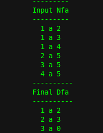

# Automaton
> Convert NFA to DFA

Screenshots
-----------


How it works
------------
The program takes NFA as an input in a file called input.txt which should be in the same directory as the program and converts it using the standard algorithm.

Usage
-----

```
g++ main.cpp
./a.out
```

License
-------

[MIT License]
